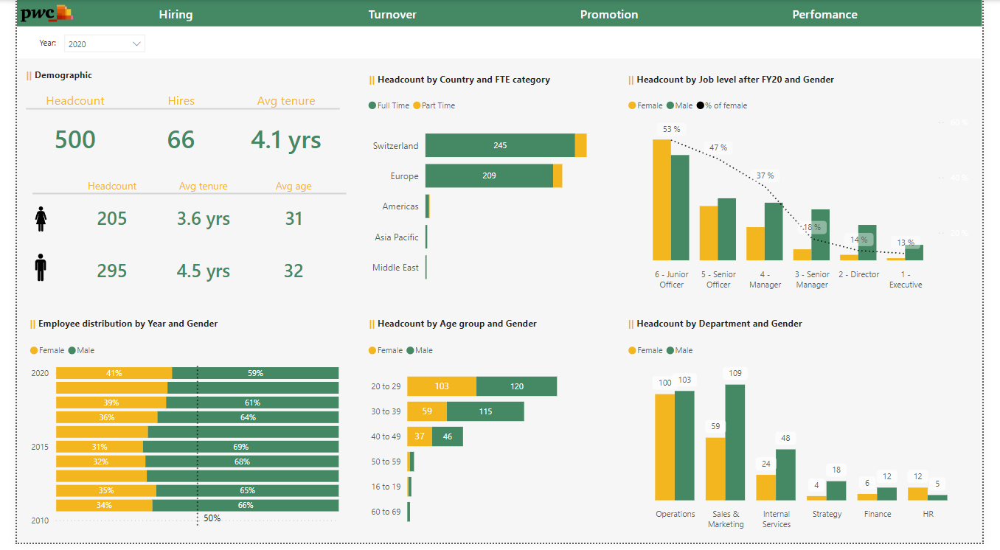
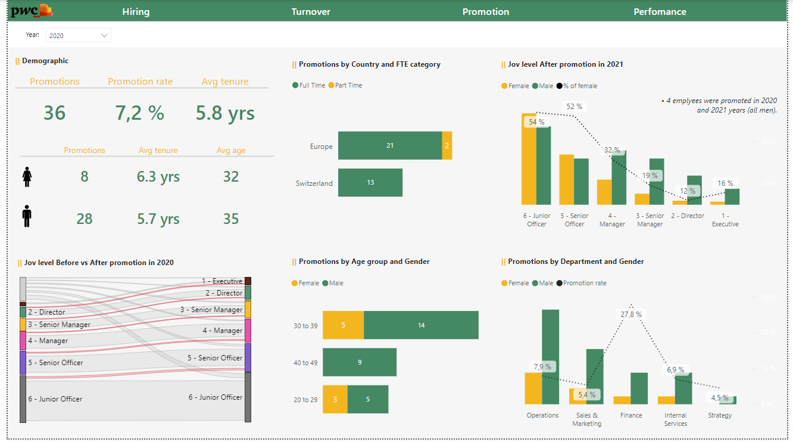

# Pwc-Diversity-Inclusion

## Task
+ Define relevant KPIs in hiring, promotion, performance and turnover, and create a visualisation in Power BI.
+ Identify potential root causes for the slow progress in achieving gender balance at the executive management level.

## Skills Demonstrated
The following Power BI features were incorporated :
+ Data Modeling
+ DAX
+ Page Navigation
+ Filters
+ Buttons

## Visualization
The Power BI report consists of 4 pages.
#### Headcount / Hiring

-----------------------------------
#### Turnover

-----------------------------------
#### Promotion

-----------------------------------
#### Perfomance

## Conclusions and Recommendations
#### 1. Career Advancement Challenges for Women.
  + *A significantly smaller number of women are promoted within the company, indicating a potential issue with equal opportunities. It is necessary to implement mentorship or support programs to encourage the career growth of women.*

#### 2. Retention Challenges for Women in Leadership Positions.
  + *Even when women are promoted, they may leave the company or struggle to remain in leadership roles. The company should review its policies on supporting women in leadership positions and create an environment that fosters their success.*

#### 3. Decreased Productivity in Leadership Roles Among Women.
  + *Since the average performance rate for women in leadership positions is slightly lower, this may indicate a need for additional support, skill development, or resources to fulfill leadership responsibilities effectively.*

#### 4. Focus on Younger Employees.
  + *As employees aged 30-39 have the highest productivity rates, the company should focus on supporting this age group to maintain high performance levels.*
